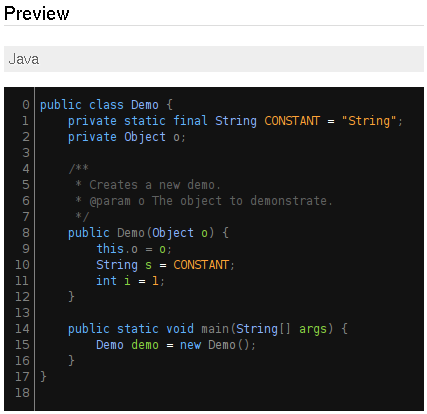

     @@@@@@@@  @@@@@@@   @@@@@@@@  @@@ @@@   @@@@@@    @@@@@@@   @@@@@@   @@@       @@@@@@@@
    @@@@@@@@@  @@@@@@@@  @@@@@@@@  @@@ @@@  @@@@@@@   @@@@@@@@  @@@@@@@@  @@@       @@@@@@@@
    !@@        @@!  @@@  @@!       @@! !@@  !@@       !@@       @@!  @@@  @@!       @@!
    !@!        !@!  @!@  !@!       !@! @!!  !@!       !@!       !@!  @!@  !@!       !@!
    !@! @!@!@  @!@!!@!   @!!!:!     !@!@!   !!@@!!    !@!       @!@!@!@!  @!!       @!!!:!
    !!! !!@!!  !!@!@!    !!!!!:      @!!!    !!@!!!   !!!       !!!@!!!!  !!!       !!!!!:
    :!!   !!:  !!: :!!   !!:         !!:         !:!  :!!       !!:  !!!  !!:       !!:
    :!:   !::  :!:  !:!  :!:         :!:        !:!   :!:       :!:  !:!   :!:      :!:
     ::: ::::  ::   :::   :: ::::     ::    :::: ::    ::: :::  ::   :::   :: ::::   :: ::::
     :: :: :    :   : :  : :: ::      :     :: : :     :: :: :   :   : :  : :: : :  : :: ::

      .: FILE:          README.md
      .: CREATED:       2012-06-03 18:41
      .: AUTHOR:        Andreas Persson (greyscale, grey)
      .: MAIL:          <andreas(at)greyscale(dot)se>
      .: DESCRIPTION:   
      
         My colortheme for eclipse.
         If your using Eclipse Color Theme plugin  (http://www.eclipsecolorthemes.org/?view=plugin)
         import the *.xml file.

         If not use Eclipse's built-in preferences import to import the *.epf file.
         See http://www.eclipsecolorthemes.org/?view=how-to-use for a video of how it's
         done if you don't know what to do.

         

   __________________________________________________________________________________________
    This file is distributed "as it is", like it? Then use it in whole or parts of it but be
    minded that it comes with absolutely no warranty. But then again you got it for free..
   __________________________________________________________________________________________

